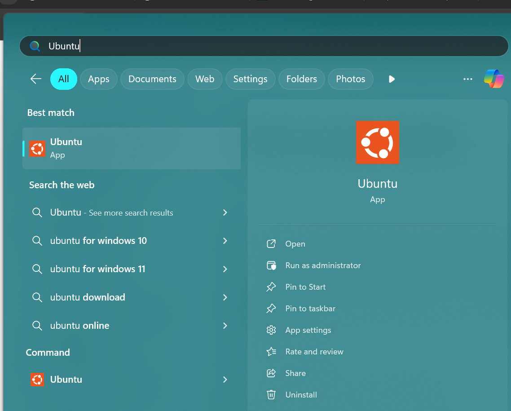
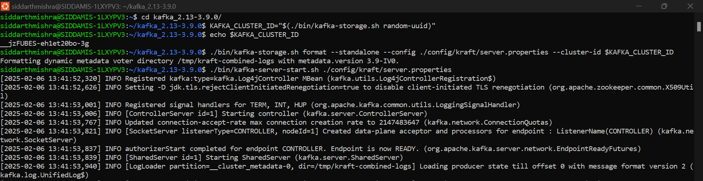
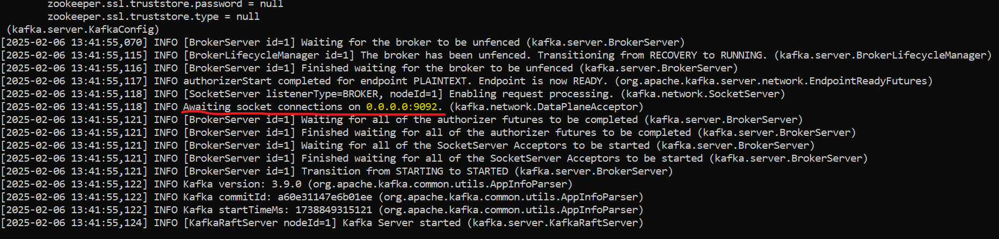
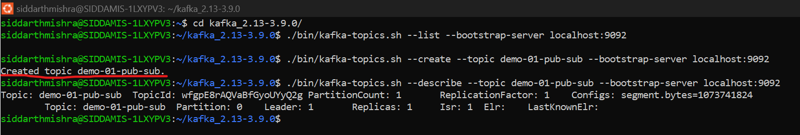

# Apache Kafka

### Documentation/Tutorials
- [Apache Kafka Documentation](https://kafka.apache.org/documentation/)
- [Apache Kafka Tutorials - conduktor](https://learn.conduktor.io/kafka/what-is-apache-kafka/)
- [Apache Kafka Tutorials - tutorialspoint](https://www.tutorialspoint.com/apache_kafka/index.htm)
- [Apache Kafka Tutorials - HowToDoInJava](https://howtodoinjava.com/kafka/apache-kafka-tutorial/)
- [What’s the Difference Between Kafka and RabbitMQ?](https://aws.amazon.com/compare/the-difference-between-rabbitmq-and-kafka/)
- [A Comparison of RabbitMQ vs Apache Kafka and When to Use Each](https://www.confluent.io/learn/rabbitmq-vs-apache-kafka/)
- [JMS vs Kafka: Which Message Broker Should You Use?](https://www.turing.com/blog/kafka-vs-jms-key-differences)

### Install Apache Kafka on Windows using Windows Subsystem for Linux (WSL)
- [How to Run Apache Kafka on Windows](https://www.confluent.io/blog/set-up-and-run-kafka-on-windows-linux-wsl-2/)
- [How to Install Apache Kafka on Windows without Zookeeper (KRaft mode)](https://learn.conduktor.io/kafka/how-to-install-apache-kafka-on-windows-without-zookeeper-kraft-mode/)



### Connectivity Issue with WSL
- Simple fix for connectivity issue is to [Disable IPv6 on WSL2](https://itsfoss.com/disable-ipv6-ubuntu-linux/). If this does not work, explore other options.
- [Connecting to Kafka running on Windows WSL 2](https://docs.conduktor.io/desktop/kafka-cluster-connection/setting-up-a-connection-to-kafka/connecting-to-kafka-running-on-windows-wsl-2/)
- [Error connecting to kafka server via IDE in WSL2](https://stackoverflow.com/questions/62511091/error-connecting-to-kafka-server-via-ide-in-wsl2)
- [Stackoverflow: Unable to produce to Kafka topic that is running on WSL 2 from Windows](https://stackoverflow.com/questions/64177422/unable-to-produce-to-kafka-topic-that-is-running-on-wsl-2-from-windows)

### Start Apache Kafka Server with KRaft

1. Step into Kafka folder assuming "kafka_2.13-3.9.0" is the folder
	```
	cd kafka_2.13-3.9.0/
	```
2. Generate a Cluster UUID
	```
	KAFKA_CLUSTER_ID="$(./bin/kafka-storage.sh random-uuid)"
	```
3. Verify the cluster ID
	```
	echo $KAFKA_CLUSTER_ID
	```
4. Format Log Directories
	```
	./bin/kafka-storage.sh format --standalone --config ./config/kraft/server.properties --cluster-id $KAFKA_CLUSTER_ID
	```
5. Start the Kafka Server
	```
	./bin/kafka-server-start.sh ./config/kraft/server.properties
	```
6. Check existing topics on the kafka server *localhost:9092*
	```
	./bin/kafka-topics.sh --list --bootstrap-server localhost:9092
	```
7. Create a topic named *demo-01-pub-sub* to store your events on the kafka server *localhost:9092*
	```
	./bin/kafka-topics.sh --create --topic demo-01-pub-sub --bootstrap-server localhost:9092
	```
8. Verify the topic *demo-01-pub-sub* on the kafka server *localhost:9092*
	```
	./bin/kafka-topics.sh --describe --topic demo-01-pub-sub --bootstrap-server localhost:9092
	```
9. Open the Kafka Producer CLI on the kafka server *localhost:9092* (Optional if connecting externally via like Java)
	```
	./bin/kafka-console-producer.sh --topic demo-01-pub-sub --bootstrap-server localhost:9092
	```
10. Open the Kafka Consumer CLI on the kafka server *localhost:9092* (Optional if connecting externally via like Java)
	```
	./bin/kafka-console-consumer.sh --topic demo-01-pub-sub --bootstrap-server localhost:9092
	```
11. Stop the Producers, Consumers and Kafka Server with Ctrl+C. Run the following command to clean up. This will remove all the data like topics, messages and offset details.
	```
	rm -rf /tmp/kafka-logs /tmp/zookeeper /tmp/kraft-combined-logs
	```

### Screenshots






